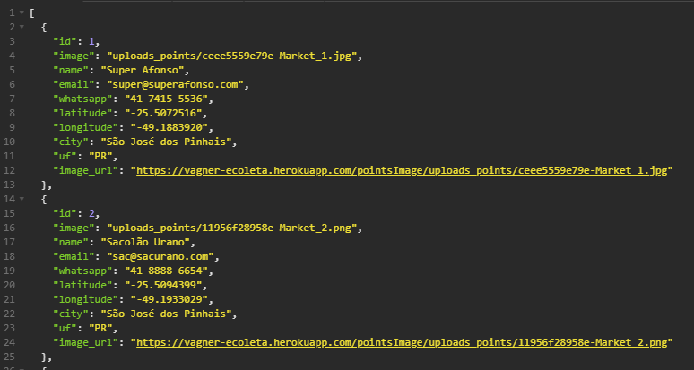
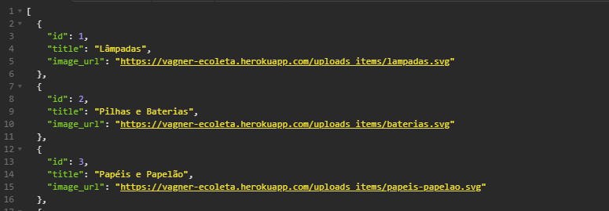

## About the project

This RESTful API was developed for the Ecoleta application. It has methods to GET items, GET items with query, POST items with transactions and GET image links.
It was hosted in Heroku and it uses PostgreSQL as database and AWS S3 for storage of images.

Ecoleta front-end was developed in mobile and web versions. Repository: https://github.com/vagner-vengue/Ecoleta


## 🛠 Technologies and concepts
- [Node.js][nodejs]
- [TypeScript][typescript]
- [Knex][knex]
- [PostgreSQL][postgreSQL]
- [AWS S3][aws_s3]
- [Heroku][heroku]


## 💡 The application

<p align="left" style="display: flex; align-items: flex-start; justify-content: center;">
    
</p>
<p align="left" style="display: flex; align-items: flex-start; justify-content: center;">
    
</p>


## 🎲 How to clone the project

Before starting, you will need:
- [Git](https://git-scm.com) installed.
- [Node.js][nodejs] installed.
- [PostgreSQL][postgreSQL] database up and running. (it can be on your local machine)
- [AWS S3][aws_s3] storage set up in AWS.
- It will also be good to have a code editor: [VSCode][vscode]

```bash
# Clone the repository.
$ git clone https://github.com/vagner-vengue/Ecoleta-API

# Access the folder.
$ cd Ecoleta-API

# Install all the dependences
$ npm install

# Initialize the knex configuration.
$ npm run knex:migrate

# Creates basic data on tables.
$ npm run knex:seed

# Start the application
$ npx ts-node src/server.ts

# The applicaton will run at: http://localhost:3333
```


## 📝 License

This project is under the MIT license. Please see [LICENSE](license) for more details.

It was created by Vagner Vengue. ([LinkedIn](https://br.linkedin.com/in/vagner-vengue-aa8b5b19))


## 🙏Acknowledgements

Thanks [Rocketseat][rocketseat] for providing the basis for this project.

The base project was developed during the "NextLevelWeek 1.0", a free course provided by Rocketseat with the goal of taking the React community to a next level of knowledge, with recent and modern software development technologies.

[typescript]: https://www.typescriptlang.org/
[nodejs]: https://nodejs.org/
[knex]: http://knexjs.org/
[postgreSQL]: https://www.postgresql.org/
[aws_s3]: https://aws.amazon.com/pt/s3/
[heroku]: https://www.heroku.com/
[vscode]: https://code.visualstudio.com/
[license]: https://github.com/vagner-vengue/Ecoleta-API/blob/aea79045854e3e53d70c9340d64d178e8d929832/LICENSE
[rocketseat]: https://rocketseat.com.br
